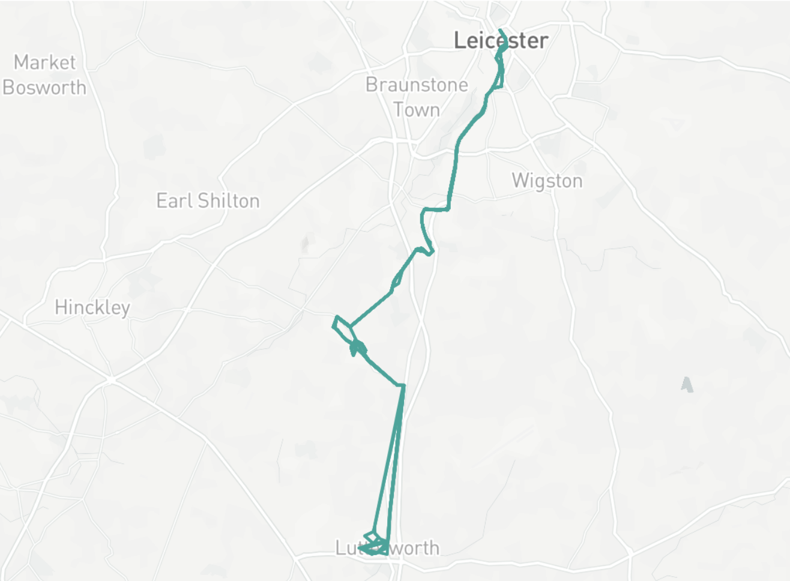
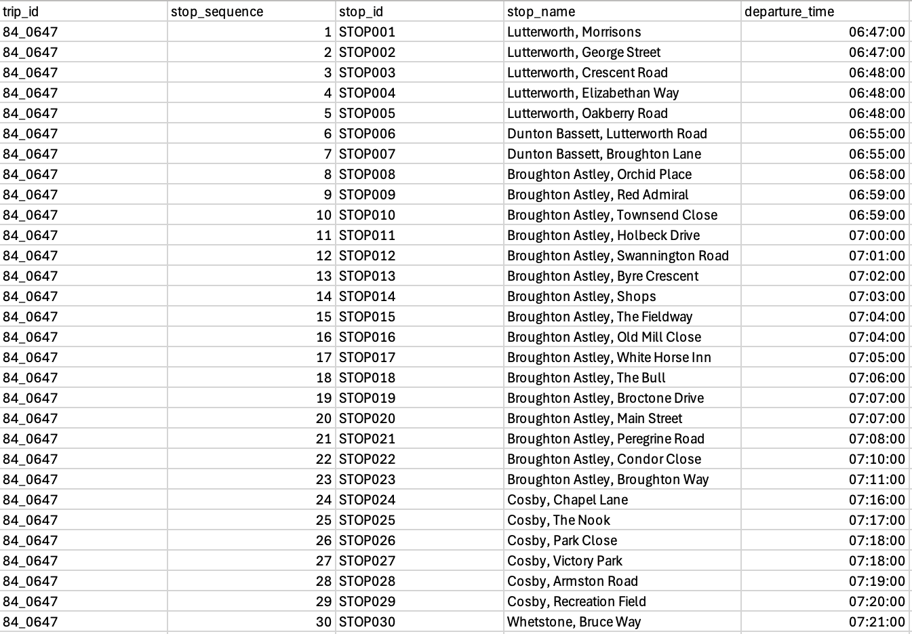
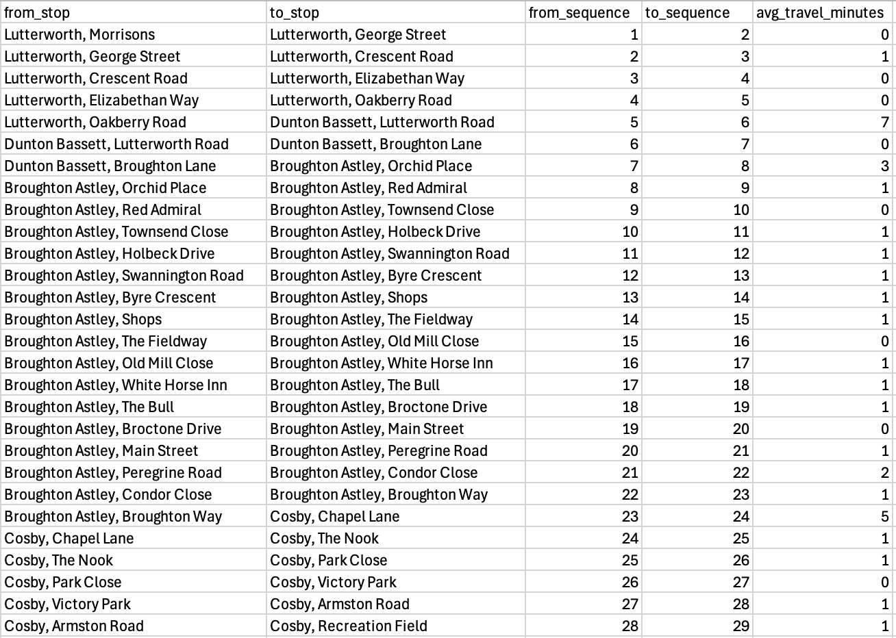
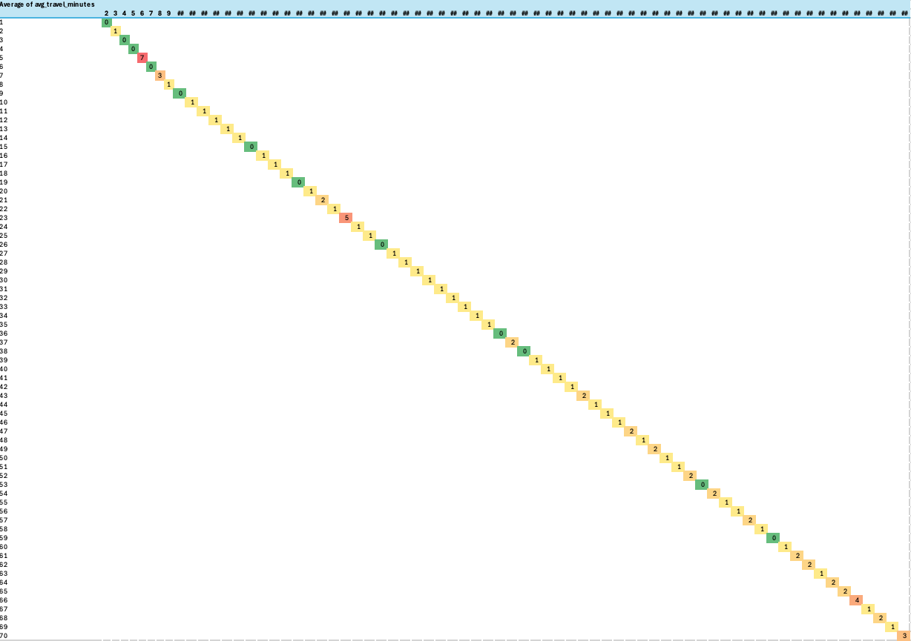
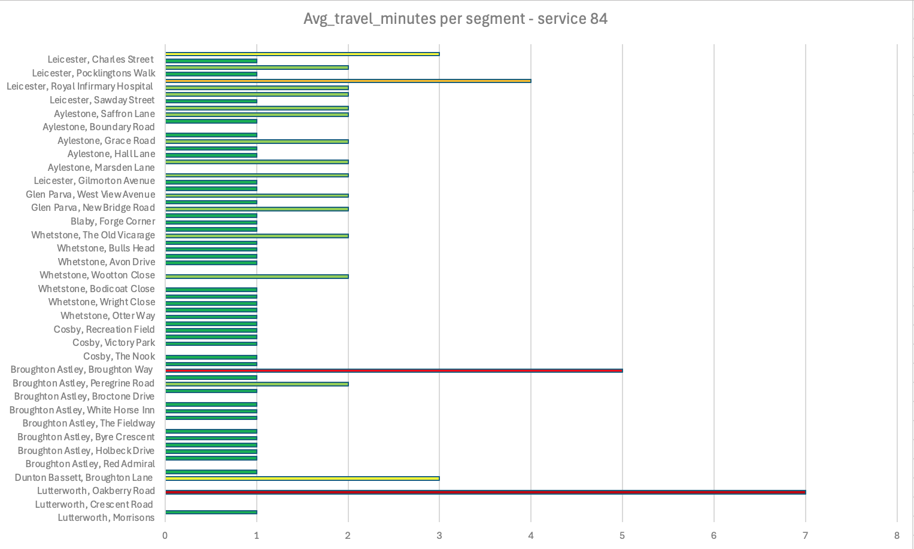

# Scheduled-time-heat-map-project
This project analyses scheduled travel times between consecutive bus stops using GTFS-style stop-times data. The bus route I will analyse is the 84 arriva service which runs from Lutterworth to Leicester. I will identify which segments of service 84 take the longest time according to the timetable, and highlight slow sections using a heat map. The goal is to understand the timetable structure and reduce average travel minutes while maintaining a realistic and operationally deliverable timetable. 

  

## Dataset 
The dataset is manually created based on real-time scheduled timetable information. The timetable data is sourced from bustimes.org.
Rows: 71
Key Fields: 
- trip_id
- stop_sequence
- stop_id
- stop_name
- departure_time

## Methodology
I built a stop_times table in excel using real-time data. The table includes trip_id, stop_sequence, stop_id, stop_name and departure time. The purpose of this stage is to tranform the raw CSV file into clean, reliable, analysis-ready data. The data cleaning process included duplicate checks, data type correction and categorical standardisation.   

   

This image is just a section of the time_stop dataset.   
The data is now ready to be exported as a CSV and uploaded into BigQuery.

## SQL Query
```sql
WITH segs AS (
  SELECT
    trip_id,
    stop_sequence,
    stop_id,
    stop_name,
    departure_time,
    LAG(stop_id) OVER (PARTITION BY trip_id ORDER BY stop_sequence) AS prev_stop_id,
    LAG(stop_name) OVER (PARTITION BY trip_id ORDER BY stop_sequence) AS prev_stop_name,
    LAG(stop_sequence) OVER (PARTITION BY trip_id ORDER BY stop_sequence) AS prev_stop_sequence,
    LAG(departure_time) OVER (PARTITION BY trip_id ORDER BY stop_sequence) AS prev_departure
  FROM `project-2-496116.stop_times.timetable`
)

SELECT
  prev_stop_name AS from_stop,
  stop_name AS to_stop,
  prev_stop_sequence AS from_sequence,
  stop_sequence AS to_sequence,
  AVG(
    TIME_DIFF(departure_time, prev_departure, MINUTE)
  ) AS avg_travel_minutes
FROM segs
WHERE prev_stop_id IS NOT NULL
GROUP BY from_stop, to_stop, from_sequence, to_sequence
ORDER BY from_sequence;
```

The purpose of this SQL query is to calculate the average travel time between every pair of consecutive stops across all trips in a GTFS time_stop table. 


 

This image is a section from the sql_time_stop dataset.

## Outputs
   


The scheduled travel time heatmap highlights how scheduled journey times vary between consecutive stops along the route. Longer segment times do not necessarily indicate congestion or delay - in many cases, they simply reflect longer distances between stops. The pattern of colours in the heatmap shows that some segments require more time thatn others. These are typically longer inter-stop distanaces or sections where the bus travels on faster roads with fewer intermediate stops. Shorter scheduled times often occur in dense urban areas with closely spaced stops, even if traffic conditions are more variable.  The heatmap therefore provides a clear picture of where the timetable allocates more or less time, helping identify whether the distribution of scheduled minutes aligns with the pysical layout of the route.

## Insights
### key results
- Total stops analysed: 71
- Total segments: 70
- Slowest segment: Lutterworth, Oakberry Road to Dunton Bassett, Lutterworth Road (7 minutes)
- Fastest segment: multiple results.
- Average sement time: 1 minute 15.42 seconds
- Number of segments > 2 minutes: 53

### Interpretations
- Longer scheduled segment times often reflect longer distances, not inefficiency.
- Some short segments have disproportionaly higher schedules minuted, indicating potential over-allocation of time.
- The heatmap reveals where the timetable may include excess padding that could be redistributed or reduced.
- Uneven distribution of scheduled minuted suggests there are opportunities to rebalance the timetable to improve overall efficiency.

## Recommendations:
- Identify short segments with high scheduled minutes.
- During off peak service times cut off specific routes in less demanded areas such as Broughton Astley and Whetstone.
- Review junction heavy segments such as Leicester, Royal infirmary hostpital. This areas has multiple short distance segments so a strategic restructure of stops could improve efficiency.
- Increase number of services per hour during peak times. There is currently one service from Lutterworth to Leicester active every hour. Increasing this to one every 20 or 30 minutes will sigificantly reduce demand per bus resulting in less stops a driver has to make.

